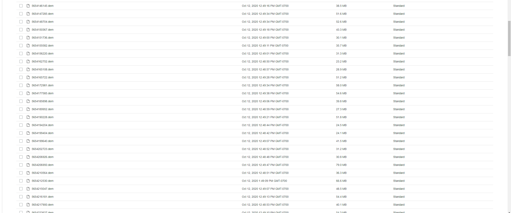

# Dota-Replay-Archiver
A set of lambda functions written in Python to periodically download and save the replay .dem files of new professional DOTA 2 matches into AWS S3 buckets. 

I've been running these lambda functions for the last 4 months, archiving roughly 3TB of replays a month, at a cost of about $5/mo (both of these vary based on match volume!). Here's an example of the output, saved into an S3 bucket:

### Why?
Replay files are only hosted for about 14 days (varies) on Valve's CDN servers. After that, they're gone for good unless they're saved somewhere else.

### How it works:
`matchid-finder` is called hourly (or however often you'd like) by a CloudWatch event. When called, it scrapes DOTA 2 match IDs from [this tracker](http://www.dota2protracker.com/), and sends the IDs of matches that do not already exist in the target S3 bucket to an SNS stream.

`replay-downloader` is called by the SNS stream with a match ID included as a parameter in each function call. The function queries [OpenDota's API](https://docs.opendota.com/) to retrieve the datacenter cluster ID and replay salt that correspond to the match ID. These two pieces of information are required to locate the replay on Valve's CDN. It then downloads the replay file from Valve's servers, and saves it to a designated S3 bucket.

## Usage:
Clone the repository onto your device. Create an SNS stream and and S3 bucket in AWS. Keep the ARN of the SNS stream and the name of the bucket handy.

Open `aws\matchid-finder\lambda_function.py` in your text editor of choice, and paste your SNS stream ARN into the constant at the top of the function. Copy `lambda_function.py` into `aws\matchid-finder\packages`, compress the folder, and upload to AWS as a lambda function. All required dependencies are already included.

Repeat these steps for `aws\replay-downloader\lambda_function.py`, similarly pasting the S3 bucket name into the constant at the top of the function.

After both lambda functions are uploaded onto AWS, set the SNS stream as a trigger for `replay-downloader`, and set `matchid-finder` to trigger hourly, or however often you'd like!
